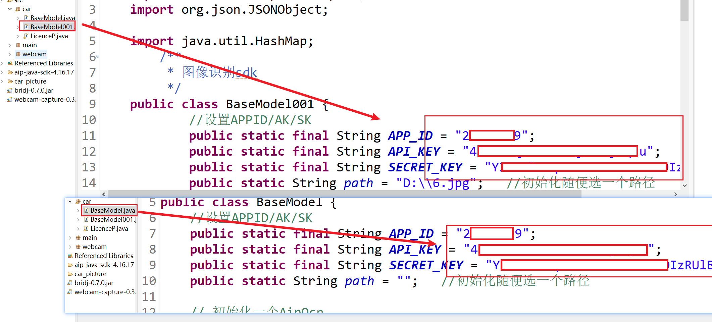

## 技术报告：自动车牌识别系统

运行前，先修改为自己的`token`



### 一、项目概述

该项目为一个自动车牌识别系统，使用计算机摄像头实时捕获图像，并通过车牌识别模块提取车牌信息。该系统展示了获取图像、显示摄像头图像流、调用车牌识别模块进行识别，以及在用户界面上展示识别结果的完整流程。

------

### 二、项目结构

该项目主要由以下几个模块组成：

1. **图像捕获模块**：通过摄像头实时捕获图像。
2. **图像显示模块**：将摄像头捕获的图像实时显示在窗口中。
3. **车牌识别模块**：处理捕获的图像，并识别车牌信息。
4. **图形用户界面 (GUI) 模块**：提供一个窗口，展示摄像头视图和识别结果。

------

### 三、代码结构与功能详解

#### 1. `AutoLicenceRecognition` 类

该类实现了整个系统的主功能，包括摄像头初始化、图像捕获与显示、车牌识别调用及界面更新。

#### 2. 属性和构造方法

构造方法 `AutoLicenceRecognition(String title)` 初始化了项目的 GUI 和摄像头，并开始车牌识别的核心流程。

- `frame`：主窗口，显示摄像头图像和识别结果。
- `imgLabel`：图像标签，显示捕获的图像。
- `resultLabel`：标签，显示识别的车牌信息。
- `webcam`：摄像头对象，获取默认摄像头并设置图像分辨率为 640x480。

```java
public AutoLicenceRecognition(String title) {
    frame = new JFrame(title);
    // ... 窗口初始化代码 ...
    // 摄像头初始化
    webcam = Webcam.getDefault();
    if (webcam != null) {
        webcam.setViewSize(new Dimension(640, 480));
        webcam.open();
        System.out.println("摄像头初始化成功!");
    } else {
        System.err.println("未能找到摄像头!");
        resultLabel.setText("无法连接到摄像头");
    }
    startDetection();
}
```

#### 3. `startDetection()` 方法

`startDetection` 方法实现了车牌检测的主循环，通过新线程持续捕获图像，将图像显示在 GUI 上并调用识别模块。

- 每隔 500 毫秒获取一次图像，更新到 `imgLabel` 中展示。
- 调用 `detectAndRecognize(image)` 方法识别车牌信息并将结果显示在 `resultLabel` 中。

```java
private void startDetection() {
    new Thread(() -> {
        while (webcam != null && webcam.isOpen()) {
            BufferedImage image = webcam.getImage();
            if (image != null) {
                imgLabel.setIcon(new ImageIcon(image));
                imgLabel.revalidate();
                imgLabel.repaint();

                String carPlateInfo = detectAndRecognize(image);
                if (carPlateInfo != null) {
                    resultLabel.setText(carPlateInfo);
                } else {
                    resultLabel.setText("没有识别到车牌！");
                }
                try {
                    Thread.sleep(500);
                } catch (InterruptedException e) {
                    e.printStackTrace();
                }
            }
        }
    }).start();
}
```

#### 4. `detectAndRecognize(BufferedImage image)` 方法

该方法接收捕获的图像，将其存储为文件，然后调用车牌识别模块 `BaseModel.licensePlate()` 进行识别。

- **图像保存**：使用 `WebcamUtils.capture()` 保存图像，文件路径使用时间戳生成。
- **识别调用**：将图像路径传递给 `BaseModel.licensePlate()` 方法，该方法返回一个 JSON 格式的字符串结果。
- **结果解析**：将 JSON 数据解析为车牌号和车牌颜色，若识别成功则返回识别结果字符串，否则返回识别失败提示。

```java
private String detectAndRecognize(BufferedImage image) {
    try {
        String fileName = "car_picture/" + System.currentTimeMillis();
        WebcamUtils.capture(webcam, fileName, ImageUtils.FORMAT_PNG);
        String res = BaseModel.licensePlate(fileName + ".png");

        JSONObject json_res = new JSONObject(res);
        JSONArray words_result = json_res.getJSONArray("words_result");
        
        if (words_result.length() > 0) {
            JSONObject resultObj = words_result.getJSONObject(0);
            String plateNumber = resultObj.getString("number");
            String plateColor = resultObj.getString("color");

            return "车牌号码：" + plateNumber + "，车牌颜色：" + plateColor;
        }
    } catch (Exception e) {
        e.printStackTrace();
    }
    return "车牌识别失败！";
}
```

#### 5. 主方法 `main`

在主线程中启动应用程序，通过 `SwingUtilities.invokeLater()` 确保 GUI 在事件分派线程中创建，以提高响应性和线程安全性。

```java
public static void main(String[] args) {
    SwingUtilities.invokeLater(() -> new AutoLicenceRecognition("自动车牌识别系统"));
}
```

------

### 四、功能流程概述

1. **初始化**：创建 GUI 窗口、初始化摄像头。
2. **图像捕获与显示**：通过 `startDetection()` 方法启动线程，不断从摄像头获取图像并显示在 GUI 窗口中。
3. **车牌识别**：将捕获的图像保存到本地，并调用 `BaseModel.licensePlate()` 进行识别。
4. **结果展示**：解析识别结果并在 `resultLabel` 标签中显示。

------

### 五、代码优缺点分析

- **优点**：
  - **实时性**：系统每隔 500 毫秒捕获一次图像，具有较好的实时性。
  - **清晰结构**：代码结构清晰，职责分离合理。
  - **易于扩展**：可以根据需要扩展检测间隔、结果展示方式等。
- **缺点**：
  - **耗资源**：持续捕获和识别图像对系统资源有一定消耗。
  - **异常处理不足**：识别失败时的错误信息提示较少，无法针对各种错误原因进行区分处理。

------

### 六、改进建议

1. **优化识别间隔**：增加一个参数用于动态调整识别间隔，提高系统性能。
2. **异常处理优化**：提供更详细的异常信息，便于调试。
3. **图像优化**：可考虑在识别前对图像进行预处理，增强识别准确性。

------

### 七、总结

本项目利用摄像头实时捕获图像，并通过 JSON 数据解析实现车牌自动识别。代码清晰，采用 Swing GUI 显示识别结果，适合用于简单的自动车牌识别任务。